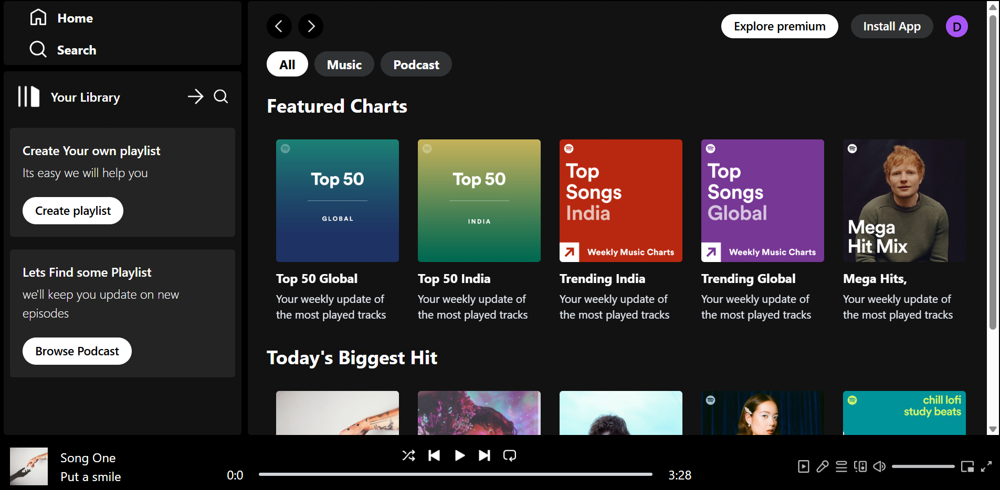
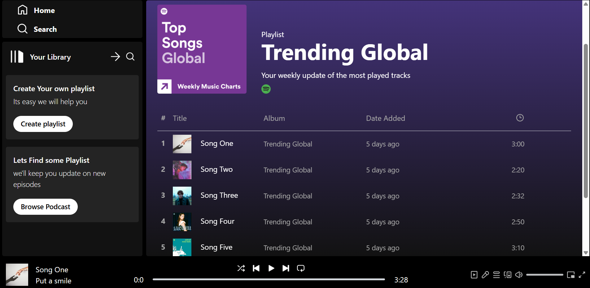
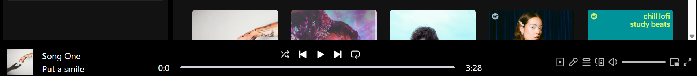

# 🎵 Spotify Clone

A fully responsive, interactive **Spotify Clone** built using **React**, **Vite**, and **Tailwind CSS**. It leverages the React Context API to manage audio playback, playlist navigation, and seek controls globally.

---

## 🚀 Deployment

This project is configured for deployment on **Vercel**, **Netlify**, or other static hosting providers. The `vercel.json` file is included in the root to handle client-side routing redirects for React Router.

---

## ✨ Features

- 🔊 **Global Audio Playback:** Seamless play, pause, next, and previous functionality driven by the HTML5 Audio API.
- 🎛️ **Interactive Seeker:** Real-time track progress updating down to the second, with click-to-seek functionality.
- 🗂️ **Dynamic Routing:** Smooth, fast client-side routing for navigating through home and specific album detail pages.
- 🎨 **Responsive Dark UI:** Beautiful modern design styled with Tailwind CSS mirroring the dark mode aesthetic of Spotify.
- 📂 **Context State Management:** Built using React Context (`PlayerContext`) to allow play controls from any component.

---

## 🛠️ Tech Stack

- **Frontend Library:** [React 19](https://react.dev/)
- **Build Tool:** [Vite](https://vite.dev/)
- **Styling:** [Tailwind CSS](https://tailwindcss.com/) & `tailwind-scrollbar-hide`
- **Routing:** [React Router v7](https://reactrouter.com/)
- **State Management:** React Context API

---

## 📸 Screenshots

<details>
<summary>🏠 Home Dashboard (Click to expand)</summary>
<br>


```markdown

```
</details>

<details>
<summary>💿 Album Details View (Click to expand)</summary>
<br>


```markdown

```
</details>

<details>
<summary>🎵 Bottom Music Player (Click to expand)</summary>
<br>


```markdown

```
</details>

---

## 💻 Getting Started

Follow these steps to run the Spotify Clone locally on your machine:

### 1. Clone the Repository
```bash
git clone https://github.com/Raushan1504/Spotify-Clone.git
cd Spotify-Clone
```

### 2. Install Dependencies
```bash
npm install
```

### 3. Start the Development Server
```bash
npm run dev
```

### 4. Build for Production
```bash
npm run build
```

---

## 📂 Project Structure
```text
Spotify-Clone/
├── public/                 # Static assets
├── src/
│   ├── assets/             # Images, icons, and audio files
│   ├── Components/         # Sidebar, Player, Navbar, Display components
│   ├── Context/            # PlayerContext for managing playback state
│   ├── App.jsx             # Main application component
│   └── main.jsx            # Application entry point
├── package.json
├── tailwind.config.js
└── vite.config.js
```

---

## 🤝 Contributing
Contributions, issues, and feature requests are welcome! Feel free to check the [issues page](https://github.com/Raushan1504/Spotify-Clone/issues) if you want to contribute.

## 📄 License
This project is open-source and licensed under the MIT License.
